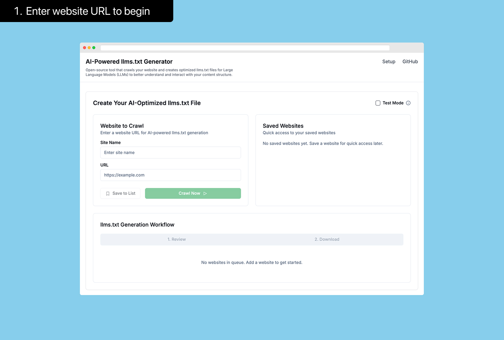
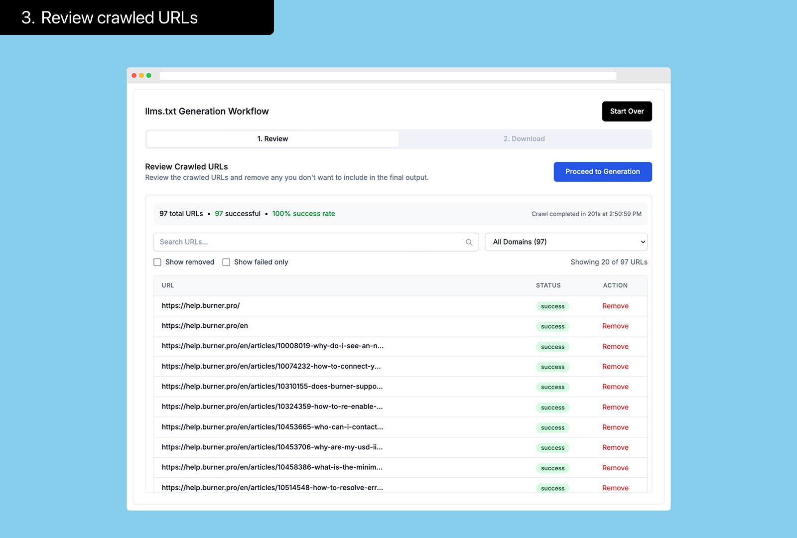
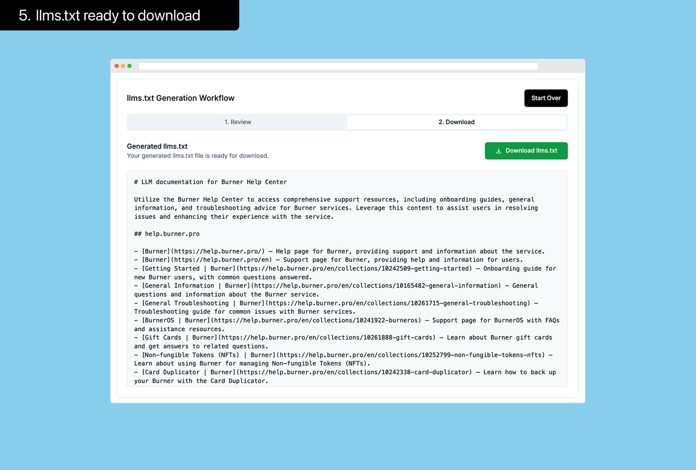

<p align="center">
  
</p>

# AI-Powered llms.txt Generator

A tool to generate AI-optimized llms.txt files for websites to help AI models better understand content structure and context.

## Workflow

<div align="center">
  <table>
    <tr>
      <td align="center"><br/><b>1. Enter website URL to begin</b></td>
      <td align="center"><br/><b>2. Crawling in progress</b></td>
    </tr>
    <tr>
      <td align="center"><br/><b>3. Review crawled URLs</b></td>
      <td align="center"><br/><b>4. AI generation in progress</b></td>
    </tr>
    <tr>
      <td align="center" colspan="2"><br/><b>5. llms.txt ready to download</b></td>
    </tr>
  </table>
</div>

*Simple 5-step process to generate AI-friendly documentation for your website. Just provide a URL and let the tool do the work!*

## Features

- **AI-Powered Descriptions**: Automatically create concise, informative descriptions for each page using ChatGPT 4o mini - chosen for its cost-efficiency and effectiveness for this specific task
- **Advanced Web Crawling**: Built on Puppeteer and JSDOM for reliable content extraction and structured data processing
- **Content Review**: Review and edit crawled links before generating descriptions
- **Robots.txt Compliant**: Respects website crawling preferences
- **Test Mode**: Option to limit crawl to 5 URLs for faster testing
- **URL Validation**: Ensures only valid and accessible URLs are processed
- **Smart Categorization**: Pages are categorized based on domain structure

## About llms.txt

### What is llms.txt?
The llms.txt file is an open standard that helps AI models better understand and interact with your website's content. Similar to how robots.txt guides search engines, llms.txt provides a curated index of your most important pages. Visit [llmstxt.org](https://llmstxt.org) for the official standard documentation.

It solves common AI crawling challenges by:

- Creating a clear content hierarchy
- Ensuring consistent discovery across subdomains
- Providing structured signals for valuable content
- Defining AI interaction preferences

### Benefits
- **Predictable AI Discovery** - Find and prioritize key content
- **Structured Content Signals** - Clear training indicators
- **Enhanced Content Understanding** - Better documentation comprehension
- **Consistent AI Interactions** - Reliable interpretation

### How the Generator Works
1. Input your website URL
2. The tool crawls your content using Puppeteer and JSDOM
3. Content structure is analyzed
4. AI generates page descriptions
5. AI creates an overall site description
6. Download the generated llms.txt file
7. Add to your website's root directory (like robots.txt)

**Before you start**: Add your OpenAI API key to the .env file to enable AI-powered content analysis. See [Setup Instructions](#getting-started).

## Tech Stack

- **Next.js 14** - React framework for frontend and API routes
- **React 18** - Component-based UI library
- **TypeScript** - For type safety and better developer experience
- **Tailwind CSS** - Utility-first styling
- **OpenAI API** - Using ChatGPT 4o mini for AI-powered descriptions
- **Puppeteer** - Headless browser for reliable web crawling
- **JSDOM** - DOM parsing outside the browser
- **React Hook Form & Zod** - Form handling and validation
- **Radix UI** - Accessible UI component primitives
- **Server-Sent Events** - For real-time crawl progress updates

## Getting Started

### Prerequisites

- Node.js 18+ 
- An OpenAI API key

### Installation

1. Clone the repository
```bash
git clone https://github.com/rdyplayerB/ai-llmstxt-generator.git
cd ai-llmstxt-generator
```

2. Install dependencies
```bash
npm install
```

3. Create a `.env.local` file in the root directory with your OpenAI API key:
```
OPENAI_API_KEY=your_api_key_here
```

4. Start the development server
```bash
npm run dev
```

5. Open [http://localhost:3000](http://localhost:3000) with your browser

## Deployment

This project can be deployed on any platform that supports Next.js applications:

1. Push your code to GitHub
2. Deploy to your preferred hosting service (Vercel, Netlify, or your own server)
3. Add your environment variables (OPENAI_API_KEY) to your hosting configuration
4. Deploy!

## License

MIT License © 2024 rdyplayerB

## Contributing

Contributions are welcome! Please feel free to submit a Pull Request.

## Acknowledgments

- This tool implements the official [llms.txt standard](https://llmstxt.org/)
- [llmstxthub.com](https://llmstxthub.com) is a great resource directory for AI-ready documentation and tools implementing the llms.txt standard
- Powered by Puppeteer for headless browser crawling and JSDOM for DOM parsing
- Thanks to the AI community for supporting and adopting this standard
- Built with positive vibes by [@rdyplayerB](https://x.com/rdyplayerB) 🤙 